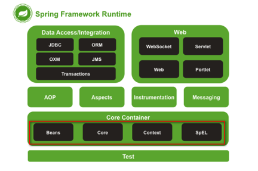
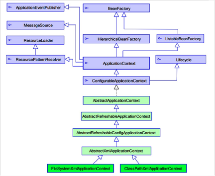

## Spring

> 一个分层的JavaEE开发的一站式开源框架。



> IOC:控制反转，将对象的创建权反转给Spring管理
>
> DI:依赖注入，前提必须有IOC环境，Spring管理这个类的时候，将这个类的依赖属性注入进来。

### 简单使用

* 编写Dao类和Dao实现类

```java

public interface UserDao {
    void save();
}

public class UserDaoImpl implements UserDao {

    @Override
    public void save() {
        System.out.println("save");
    }
}

```

* `applicationContext.xml`配置bean

```
<bean id="userDao" class="com.eamon.spring.UserDaoImpl"></bean>

```

* 编写测试类

```
// 创建工厂
ApplicationContext context = new ClassPathXmlApplicationContext("applicationContext.xml");
UserDao dao = (UserDao)context.getBean("UserDao");
dao.save();
```

### Spring工厂类

* 结构图



* ApplicationContext继承BeanFactory
* ApplicationContext加载配置文件时会将Spring管理的类都实例化。
* ApplicationContext实现类
	* **ClassPathXmlApplicationContext**: 加载类路径下的配置文件
	* **FileSystemXmlApplicationContext**:加载文件系统下的配置文件

### Bean的相关配置

* **id**: 使用了约束中的唯一约束，里面不能出现特殊字符。
* **name**: 没有使用约束中的唯一约束。里面可以出现特殊字符。
* **init-method**: Bean被初始化的时候执行的方法。
* **destory-method**: Bean被销毁的时候执行的方法。
* **scope**: Bean的作用范围
	* singleton: 默认，Spring会采用单例模式来创建这个对象
	* prototype: 多例模式。
	* request: 应用在web项目中, Spring创建这个类以后，将这个类存入request范围中
	* session: 应用在web项目中, Spring创建这个类以后，将这个类存入session范围中
	* globalsession: 应用在web项目中，必须在porlet环境下使用。但是如果没有这种环境，相对于session。

### Spring的属性注入

##### 构造方法的方式属性注入

```xml
<bean id="user" class="com.eamon.spring.User">
	<constructor-arg name="name" value="value"/>
</bean>

```

##### set方法的方式属性注入

```xml
<bean id="user" class="com.eamon.spring.User">
	<property name="name" value="张三"/>
	<property name="age" value="12" />
</bean>

```

#####  set方法设置对象类型的属性

```xml
<!-- ref：其它类的id或name-->
<bean id="user" class="com.eamon.spring.User">
	<property name="name" value="张三"/> 
	<property name="product" ref="product"/>
</bean>
```
#####  P名称控件的属性注入（Spring2.5+）

```xml
<bean
	...
	xmlns:p="http://www.springframework.org/schema/p">
	
	<!-- 使用p名称控件 -->
	<bean id="user" class="com.eamon.spring.User" p:name="张三" p:age="12"></bean>
	<bean id="product" class="com.eamon.spring.product" p:name="酱油" p:user-ref="user"></bean>

</bean>
```

##### SpEL属性注入（Spring3+）

```xml
<bean id="productInfo" class="com.eamon.spring.pdocutInfo" />

<bean id="product" class="com.eamon.spring.product">
	<property name="name" value="#{productInfo.name}"></property>
	<property name="price" value="#{productInfo.getPrice()}">
</bean>

<bean id="user" class="com.eamon.spring.User">
	<property name="name" value="#{"张三"}"/>
	<property name="product" value="#{product}"/>
</bean>

```